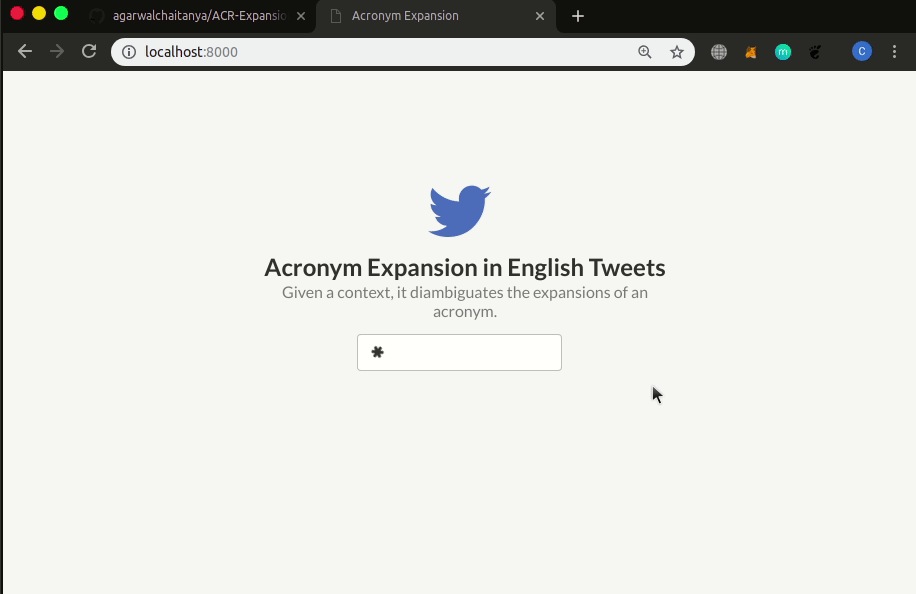

# ACR-Expansion-in-English-Tweets
> Acronyms are present all across social media to express information that is repetitive and well known. But acronyms can be ambiguous because there can be many expansions of the same acronym. This project aims to disambiguate between multiple expansions of an acronym given some context.

The app has been deployed [here](https://secret-fjord-90750.herokuapp.com/).
## ToDo :penguin:
- [x] Implement Search 
- [x] Build Doc2Vec/BOW/TFIDF Models for Gensim Classifiers
- [ ] Containerize
- [x] Auto Deploy
- [ ] Host the Doc2Vec Model

## Peek

